# One Piece TCG Digital App - System Architecture

## 🏗️ High-Level Architecture

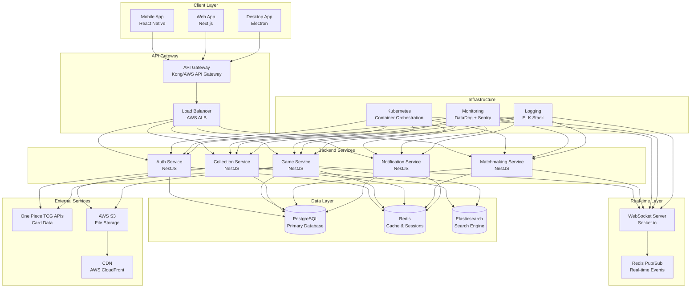

## 📱 Client Architecture

### Mobile App (React Native)
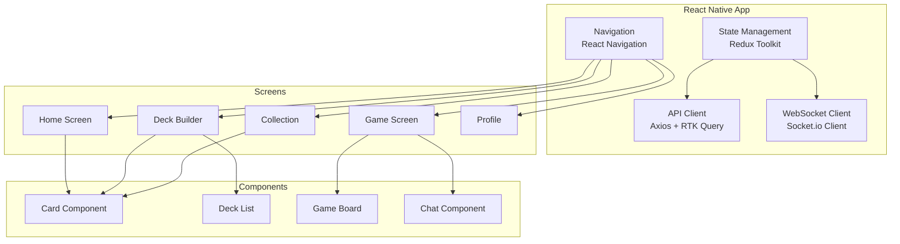

### Web App (Next.js)
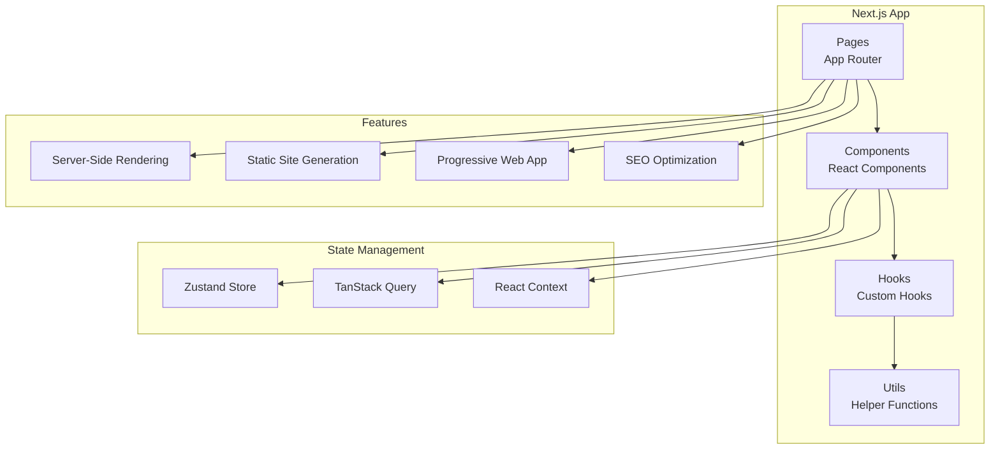

## 🔧 Backend Architecture

### Microservices Structure
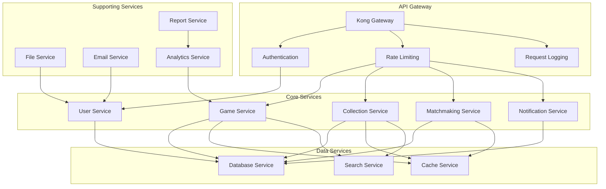

### Database Architecture
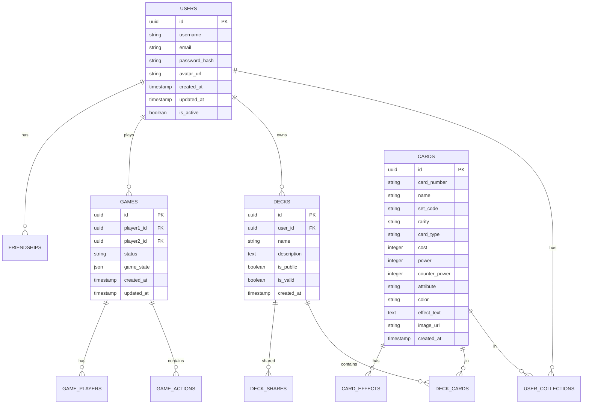

## 🔄 Real-time Communication

### WebSocket Architecture
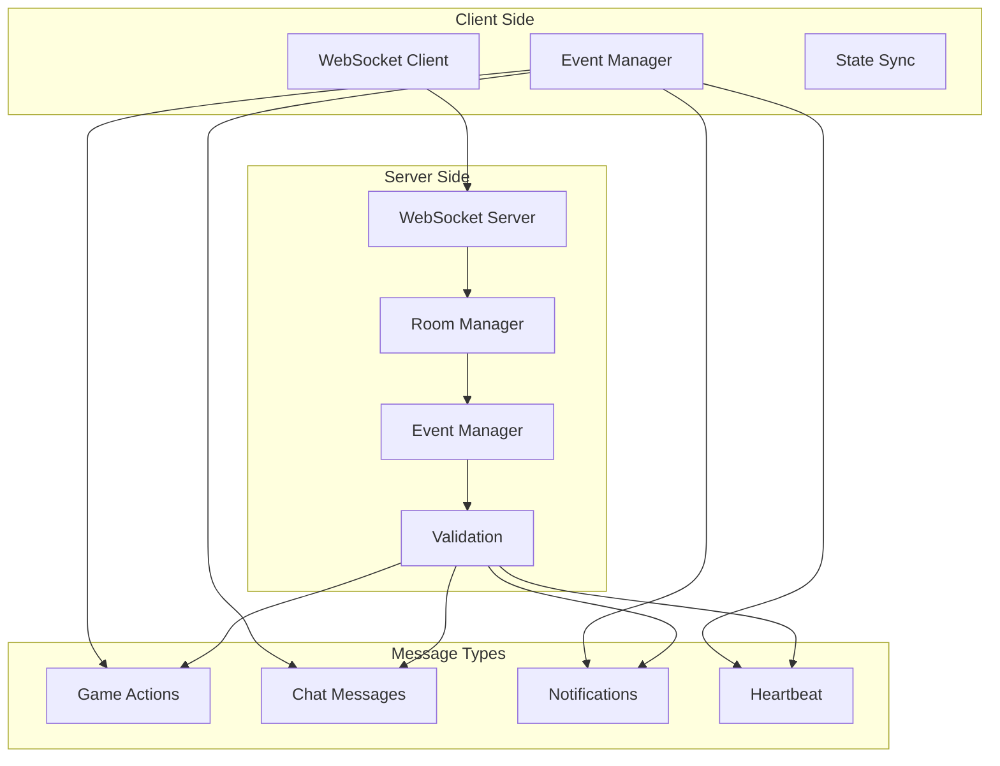

### Event Flow
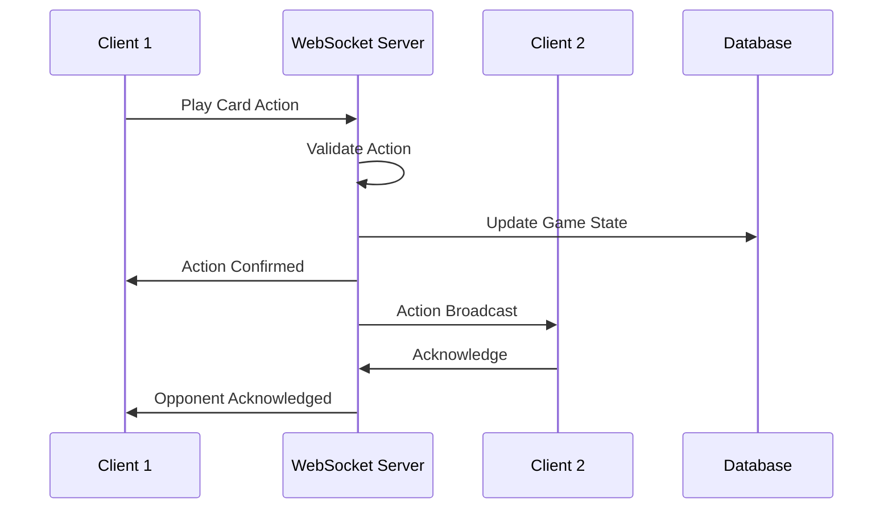

## 🎮 Game Engine Architecture

### Game State Management
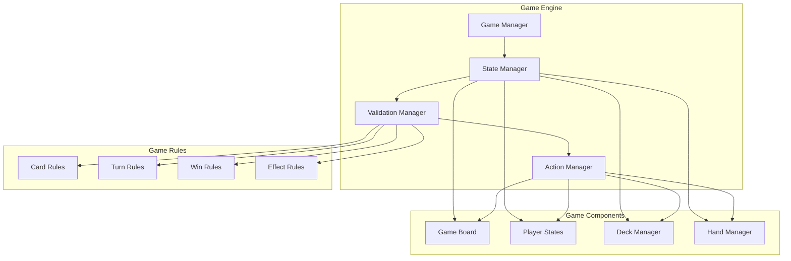

### Card System Architecture
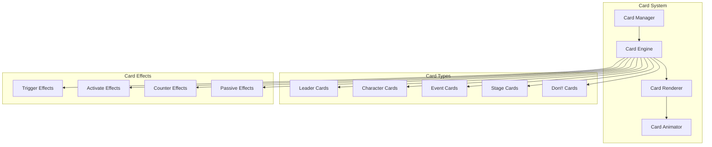

## 🔐 Security Architecture

### Authentication Flow
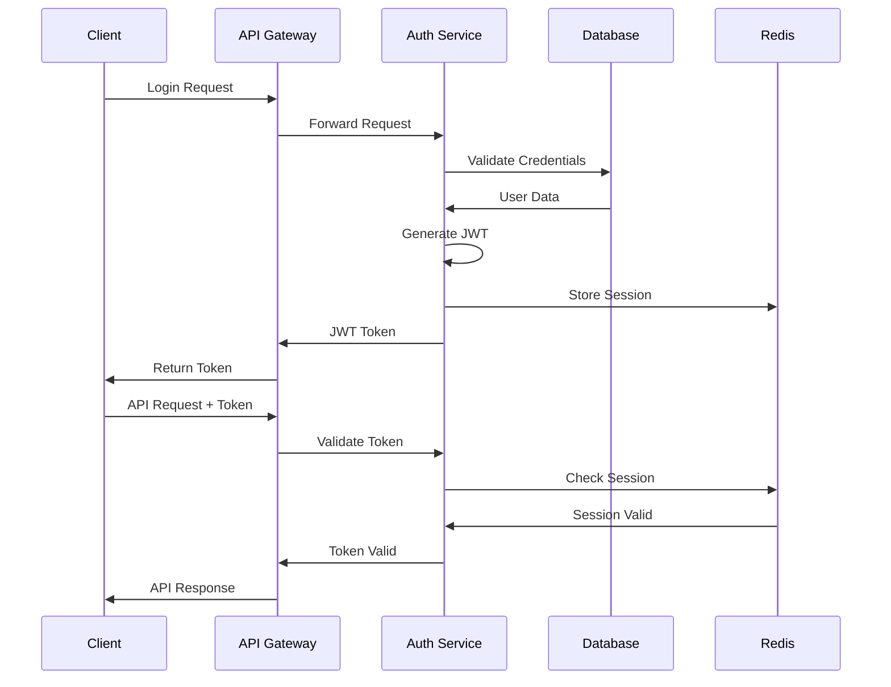

### Security Layers
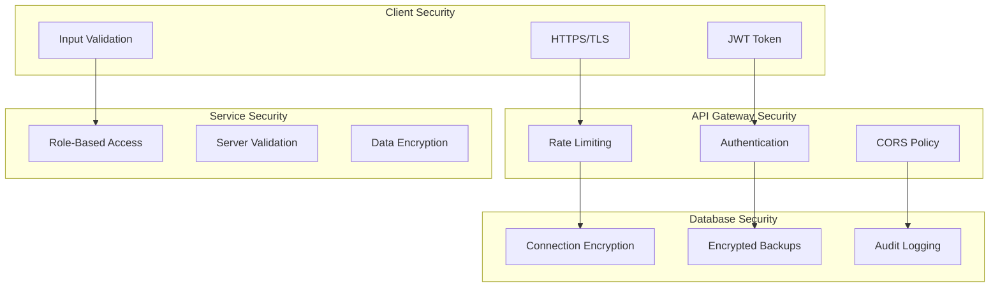

## 📊 Monitoring & Analytics

### Monitoring Stack
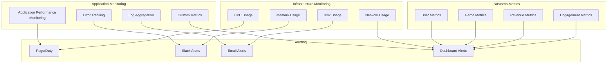

## 🚀 Deployment Architecture

### Kubernetes Deployment
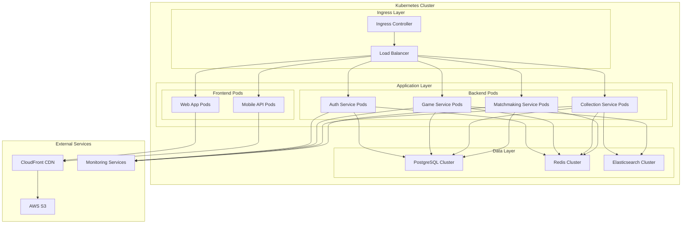

## 🔄 CI/CD Pipeline

### Deployment Pipeline
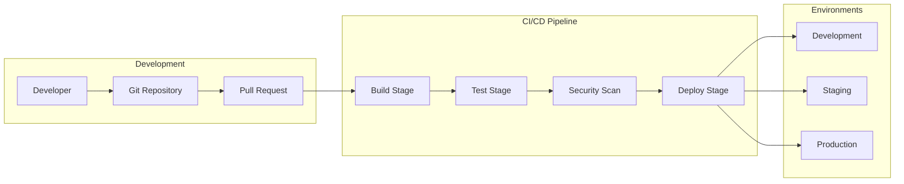

## 📈 Scalability Architecture

### Horizontal Scaling
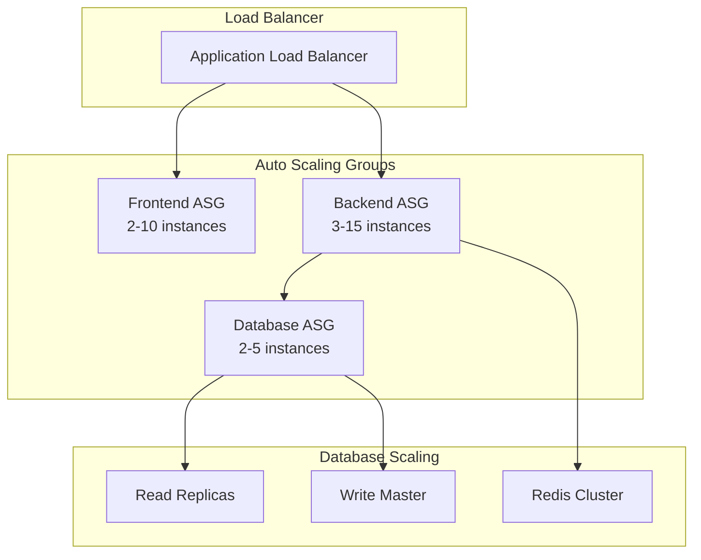

### Performance Optimization
- **CDN**: Global content delivery
- **Caching**: Multi-layer caching strategy
- **Database**: Read replicas and connection pooling
- **Microservices**: Independent scaling
- **Load Balancing**: Traffic distribution
- **Monitoring**: Real-time performance tracking
